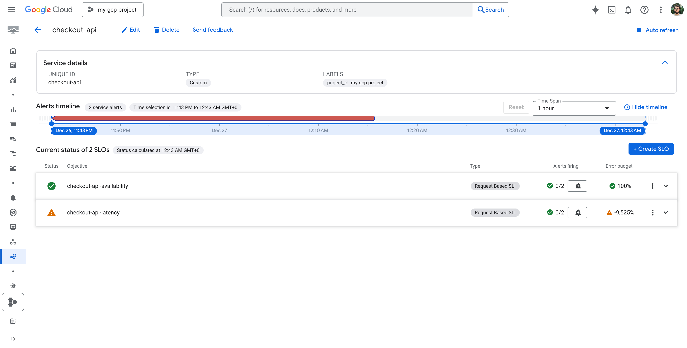
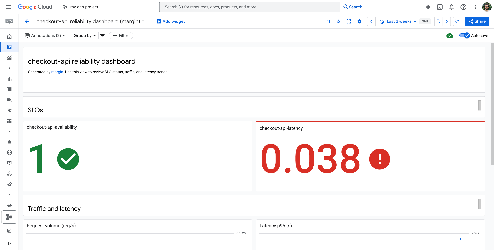

# margin

**Opinionated SLOs and error budgets for Google Cloud.**

`margin` is a small CLI that helps teams define **Service Level Objectives (SLOs)**, compute **error budgets**, and create **burn-rate alerts** for Google Cloud services using Cloud Monitoring.

Instead of hand-crafting metrics, alerts, and dashboards per service, `margin` applies a consistent, SRE-driven reliability model with **safe defaults** and **clear escape hatches**.

---

## Why margin

Google Cloud provides powerful observability primitives, but teams often struggle with:

* Inconsistent SLO definitions across services
* Alert fatigue caused by threshold-based alerts
* Error budgets that exist in dashboards but don’t influence decisions
* Copy-pasted Monitoring configs that drift over time

`margin` addresses these gaps by treating **SLOs as the contract** and deriving everything else from them.

---

## What margin does

Given a simple YAML spec, `margin` will:

* Create availability and latency **SLOs** in Cloud Monitoring
* Generate **multi-window burn-rate alerts** (fast and slow)
* Attach standard labels, annotations, and runbook links
* Create a ready-to-use **service reliability dashboard**
* Apply changes **idempotently** and safely

All resources are created directly via Google Cloud APIs using Application Default Credentials.

---

## What margin does not do

* It is **not** a general observability platform
* It does **not** replace Terraform or the Cloud Monitoring UI
* It does **not** attempt to support every metric or service
* It does **not** auto-page humans for every signal

`margin` is intentionally narrow: it encodes **well-understood SRE practices** and leaves the rest to your existing tooling.

---

## Design principles

* **Alert on symptoms, not causes**
* **Page on fast burns, ticket on slow burns**
* **Prefer boring, explicit configuration**
* **Optimize for clarity over flexibility**

---

## Status

`margin` is an open-source project designed to be:

* Useful for real Google Cloud users
* Safe to run in production projects
* Easy to understand, modify, and extend

See [`docs/design.md`](docs/design.md) for architecture and trade-offs.

---

## Quick start

```bash
go build ./cmd/margin
./margin validate -f examples/slo.yaml --project my-gcp-project
./margin plan -f examples/slo.yaml --project my-gcp-project
```

## Supported services (v0.3)

- Cloud Run (`cloud-run`)
- HTTPS Load Balancer (`https-load-balancer`)
- GKE Ingress (`gke-ingress`)
- Cloud SQL (`cloud-sql`)
- GKE Service (`gke-service`)
- GKE Gateway (`gke-gateway`)
- GCE Load Balancer (`gce-lb`)
- Cloud Functions (`cloud-functions`)
- Pub/Sub Subscription (`pubsub-subscription`)
- Cloud Storage (`cloud-storage`)
- Cloud Tasks (`cloud-tasks`)
- BigQuery (`bigquery`)
- Spanner (`spanner`)

## Screenshots

SLOs in Cloud Monitoring:



Dashboard overview:



## Analyze an incident

`margin analyze` turns a time window into an SLO impact report.

```bash
./margin analyze \
  --project my-gcp-project \
  --service checkout-api \
  --last 90m \
  --out ./out \
  --explain
```

Outputs:

- `summary.md`
- `summary.json`
- `sources.json`
- `errors.md` (only if partial)

## Exports

`margin export terraform` writes a standalone `main.tf.json` with Monitoring resources.

```bash
./margin export terraform -f examples/slo.yaml --out out/terraform
```

`margin export monitoring-json` writes raw Monitoring API JSON payloads.

```bash
./margin export monitoring-json -f examples/slo.yaml --out out/monitoring-json
```

## Spec notes

`margin` supports an optional `alerting` block to tune burn-rate alert generation:

```yaml
alerting:
  burnRateResourceType: global
```

`burnRateResourceType` is required by Cloud Monitoring when building burn-rate alert filters. When omitted, `margin` defaults to `global`. If your project uses a different resource type for SLO burn rate, set it explicitly.

## Repository layout

```text
cmd/margin/          # CLI entrypoint
internal/spec/       # YAML spec parsing and validation
internal/planner/    # Resource planning and naming
internal/alerting/   # Burn-rate math and explainers
internal/monitoring/ # GCP Monitoring API wrappers
docs/                # Design and alerting rationale
examples/            # Sample specs
runbooks/            # Runbook guidance
```
