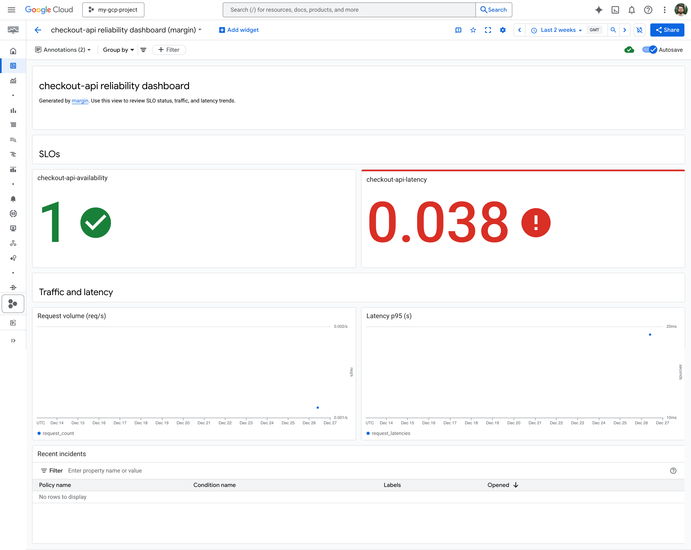

# Dashboard

This dashboard is generated by `margin apply` and provides a standard reliability view.

Widgets:

- Intro text with service name and runbook link (if `metadata.runbook` is set).
- SLO scorecards (up to 9) with burn-breach threshold (red below goal).
- SLO compliance table (`select_slo_compliance`) across all SLOs.
- Traffic chart (request volume) based on the service template metrics.
- Latency chart (p95) based on the service template metrics.
- Incident list for the service’s resource type.

Layout:

- Scorecards in a row of 1/2/3 per row depending on count.
- Traffic/latency charts arranged two per row.

